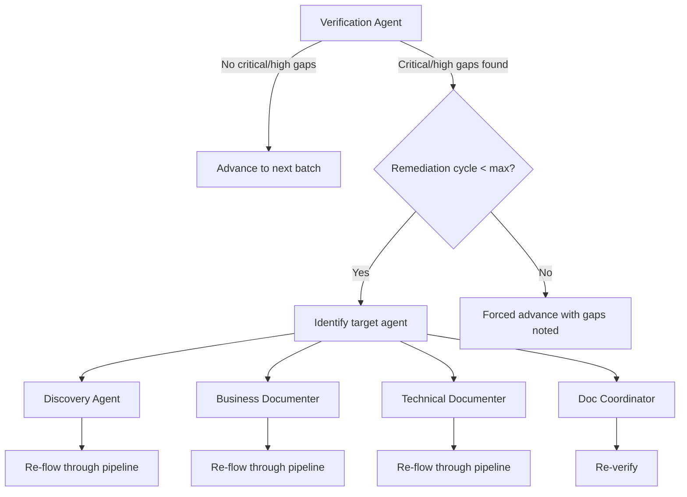

# Multi-Agent System Design — Autonomous Batch Pipeline

## Overview

This document describes the **autonomous batch pipeline** architecture for repository documentation. The system runs without user intervention — the user invokes the Planning Agent once, and the entire pipeline runs to completion.

## Design Principles

- **Fully Autonomous**: No user intervention after initial invocation
- **Batch-Oriented**: Small batches (5-15 items) flow through the full pipeline one at a time
- **Self-Healing**: Verification agent loops back for remediation (max 2 cycles)
- **State-Driven**: Single state file coordinates all agents
- **Focused Context**: Each agent works only on the current batch's scope

---

## Pipeline Architecture

```
User invokes Planning Agent (once)
         │
         ▼
    Planning Agent
    ├── Detects language
    ├── Divides codebase into batches
    ├── Creates state file + plan
    └── Hands off to Discovery (batch 1)
         │
         ▼
┌─────────────────────────────────────────────────────────────────┐
│  PER-BATCH PIPELINE (repeats for each batch):                  │
│                                                                 │
│  Discovery ──▶ Business ──▶ Technical ──▶ Coordinator ──▶ Verification │
│      ▲                                                    │     │
│      └──────────── remediation (max 2 cycles) ◀───────────┘     │
│                                                                 │
│  Verification PASS → next batch                                 │
│  Verification FAIL → loop back to target agent                  │
│  Max remediation → forced advance with noted gaps               │
└─────────────────────────────────────────────────────────────────┘
         │
         ▼
    Pipeline Complete
```

---

## Agent Definitions

### 1. Planning Agent (`planning-agent.md`)

**Responsibility**: Analyze codebase, create batches, initialize state, kick off pipeline.

| Input | Output |
|-------|--------|
| Source code repository | `docs/[module]-state.json` |
| | `docs/documentation-plan.md` |

**Hands off to**: Discovery Agent (batch 1)

---

### 2. Discovery Agent (`discovery.agent.md`)

**Responsibility**: Analyze source code for ONE batch. Discover flows, components, domain concepts, data access rules.

| Input | Output |
|-------|--------|
| State file + batch scope | `docs/discovery/batch-[ID]-flows.md` |
| Source code (batch files only) | `docs/discovery/batch-[ID]-components.md` |
| | `docs/discovery/batch-[ID]-domain-concepts.md` |

**Hands off to**: Business Documenter Agent

---

### 3. Business Documenter Agent (`business-documenter.agent.md`)

**Responsibility**: Transform discovery artifacts for ONE batch into use cases, business requirements, process diagrams.

| Input | Output |
|-------|--------|
| State file + discovery artifacts | `docs/business/use-cases/UC_[BATCH]_*.md` |
| | `docs/business/processes/BP_[BATCH]_*.md` |

**Hands off to**: Technical Documenter Agent

---

### 4. Technical Documenter Agent (`technical-documenter.agent.md`)

**Responsibility**: Derive functional requirements and technical flows for ONE batch.

| Input | Output |
|-------|--------|
| State file + business + discovery | `docs/functional/requirements/FUREQ_[BATCH]_*.md` |
| | `docs/functional/flows/FF_[BATCH]_*.md` |

**Hands off to**: Documentation Coordinator Agent

---

### 5. Documentation Coordinator Agent (`doc-coordinator.agent.md`)

**Responsibility**: Update global indexes, traceability matrices, and cross-references for ONE batch.

| Input | Output |
|-------|--------|
| State file + all batch artifacts | Updated `docs/index.md` |
| Existing global indexes | Updated traceability matrices |

**Hands off to**: Verification Agent

---

### 6. Verification Agent (`verification.agent.md`)

**Responsibility**: Cross-check ONE batch's documentation against source code. Quality gate.

| Input | Output |
|-------|--------|
| State file + all batch artifacts | `docs/verification/batch-[ID]-gap-report.md` |
| Source code (batch files only) | `docs/verification/batch-[ID]-table-usage.md` |

**Decision**:
- **PASS** → hands off to Discovery Agent (next batch) or completes pipeline
- **FAIL** → hands off to target agent for remediation, which then re-flows through pipeline
- **MAX REMEDIATION** → forced advance with noted gaps

---

## Handoff Mechanism

Every agent ends by invoking the next agent via the `task` tool:

```markdown
Use the `task` tool with:
- agent_type: "[Next Agent Name]"
- prompt: "Continue autonomous pipeline. Process batch [ID]..."
- mode: "background"
```

No user intervention possible or needed.

---

## State File

Single JSON file (`docs/[module]-state.json`) tracks:
- Pipeline status (running/complete)
- Batch queue with per-batch phase status
- Current batch pointer
- Remediation cycle counts
- Progress percentage

See `state-management` skill for full schema.

---

## Batch Strategy

| Codebase Size | Batch Size | Expected Batches |
|---------------|-----------|-----------------|
| < 20 files | 5-10 | 2-4 |
| 20-50 files | 8-12 | 4-6 |
| 50-100 files | 10-15 | 5-10 |
| > 100 files | 10-15 | 8+ |

Batches are ordered: foundational/infrastructure first, dependent domains later.

---

## Remediation Flow



---

## Success Criteria

- ✅ User invokes ONE agent (Planning) — everything else is automatic
- ✅ Each batch completes the full pipeline before the next starts
- ✅ Verification can loop back to ANY agent for remediation
- ✅ Max 2 remediation cycles prevents infinite loops
- ✅ Small batches keep context focused and manageable
- ✅ State file is single source of truth
- ✅ All agents are language-agnostic with skill routing

